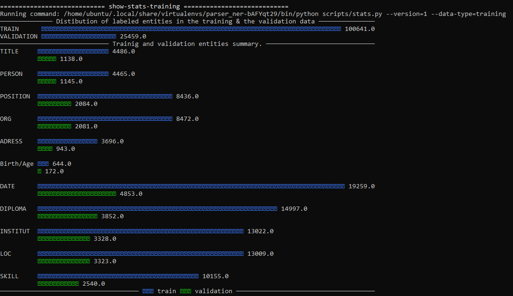

<!-- SPACY PROJECT: AUTO-GENERATED DOCS START (do not remove) -->

# 🪐 spaCy Project: Entities extraction from resume sections (NER/SpanCat).

This project uses spaCy (NER) / (Span Categorizer) to extract resume entities

## 📋 project.yml

The [`project.yml`](project.yml) defines the data assets required by the
project, as well as the available commands and workflows. For details, see the
[spaCy projects documentation](https://spacy.io/usage/projects).

### ⏯ Commands

The following commands are defined by the project. They
can be executed using [`spacy project run [name]`](https://spacy.io/api/cli#project-run).
Commands are only re-run if their inputs have changed.

| Command | Description |
| --- | --- |
| `preprocess` | Preprocess different sections data and merge it in two training and validation files |
| `show-stats-raw` | Show different stats about raw data |
| `show-stats-training` | Show different stats about training data |
| `convert` | Convert data to spaCy format |
| `debug` | debug training data |
| `train` | Train spaCy pipline |
| `evaluate` | Evaluate the trained model and export metrics |
| `clean-preprocessed` | Delete the preprocessed files |
| `clean` | Clean corpus and training data files |
| `resume-training` | Resume training spaCy ner pipline with the transformer architecture |

### ⏭ Workflows

The following workflows are defined by the project. They
can be executed using [`spacy project run [name]`](https://spacy.io/api/cli#project-run)
and will run the specified commands in order. Commands are only re-run if their
inputs have changed.

| Workflow | Steps |
| --- | --- |
| `all` | `preprocess` &rarr; `show-stats-training` &rarr; `convert` &rarr; `train` &rarr; `evaluate` |

<!-- SPACY PROJECT: AUTO-GENERATED DOCS END (do not remove) -->

### ⏭ Train data summary

### ⏭ Trained model validation summary
The pipline trained is **NER** and the config used for training is **transformer-distilbert**.

### 📊 Results:

##### 📝 Validation Summary:

**Validation metrics**:

- P: Precision
- R: Recall
- F: F1 Score

| P | R | F |
|:-----|:--------:|------:|
| 0.97 | 0.96 | 0.97 |

##### 📝 Entities Details:

**PERSON**

| P | R | F |
|:-----|:--------:|------:|
| 1 | 0.99 | 0.99 |

**TITLE**

| P | R | F |
|:-----|:--------:|------:|
| 0.97 | 0.97 | 0.97 |

**ADDRESS**

| P | R | F |
|:-----|:--------:|------:|
| 0.97 | 0.97 | 0.97 |

**POSITION**

| P | R | F |
|:-----|:--------:|------:|
| 0.96 | 0.93 | 0.95 |

**ORG**

| P | R | F |
|:-----|:--------:|------:|
| 0.96 | 0.95 | 0.95 |

**DATE**

| P | R | F |
|:-----|:--------:|------:|
| 0.98 | 0.98 | 0.98 |

**DIPLOMA**

| P | R | F |
|:-----|:--------:|------:|
| 0.97 | 0.95 | 0.96 |

**INSTITUTE**

| P | R | F |
|:-----|:--------:|------:|
| 0.96 | 0.96 | 0.96 |

**LOC**

| P | R | F |
|:-----|:--------:|------:|
| 0.97 | 0.98 | 0.98 |

**Birth/Age**

| P | R | F |
|:-----|:--------:|------:|
| 1 | 1 | 1 |

**SKILL**

| P | R | F |
|:-----|:--------:|------:|
| 0.97 | 0.96 | 0.96 |
